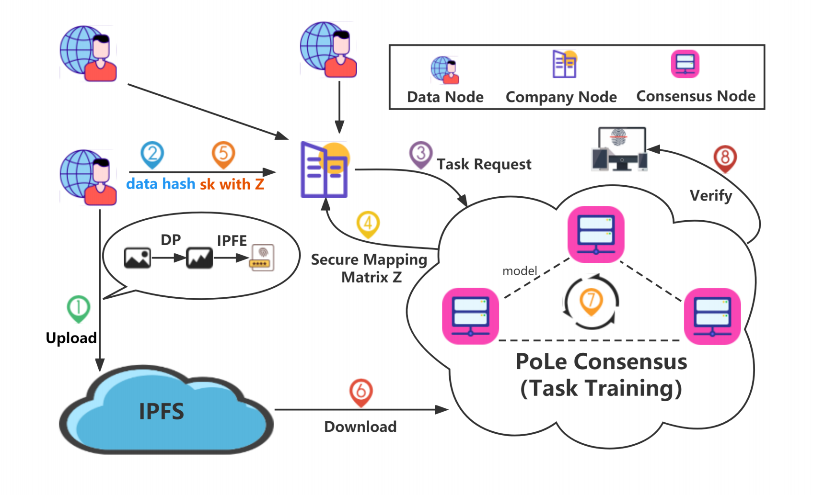

# FaceChain
### System Workflow and Core Algorithms

In FaceChain, there are three types of users: data nodes, company nodes and consensus nodes, forming a p2p network. Data nodes possess private facial data and the data is locally processed by a differential privacy (DP) protocol so as to remove the sensitivity in the data. The desensitized facial data is then encrypted following a inner product functional encryption (IPFE) algorithm and the cipher data is then stored in a decentralized interplanetary file system (IPFS) and a unique hash is returned to the data owner for retrieval. A company node collects its emplyers' facial data hashes and publishes a face recognition task transaction in the blockchain network composed by consensus nodes. The tasks are then recorded and trained by the consensus nodes by following the proof of learning (PoLe) consensus protocol proposed in our previous work.

### Case Demonstration

We illustrate the system logic in a case chosen in celebA dataset and present how a face recognition model is trained and tested as shown in Figure \ref{fig:case}. A face image of a girl is processes by DP to generate an image from which the identity of the girl can not be matched. The image is then encrypted to obtain a feature based grayscale image which is used to train a model by PoLe blockchain consensus network for a company employing the girl. With the model, the company can recognition the attendance of the girl's face where the test face is also encrypted without leaking the girl's privacy. In this way, the privacy of face images are preserved during storage, training, and usage.

### Usage
step 1: start the IPFS docker and add into the private network.
step 2: start data node、company node、consensus node
```python
 python3 gui_main.py
 ```
 step 3: image encrypt and upload
 step 4: release the task
 step 5: train the model
 step 6: use the model to do the face recognization
